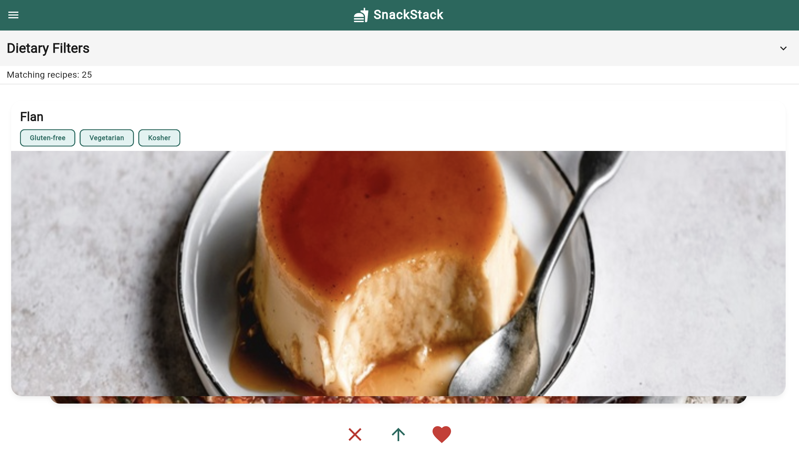
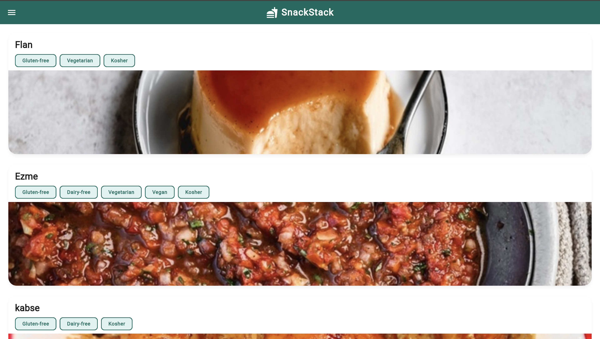
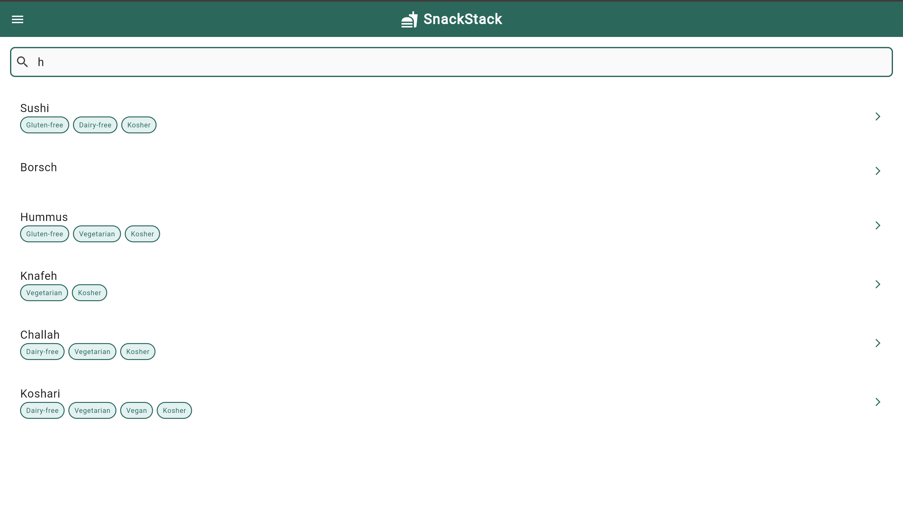

  

# 🍽️ SnackStack — Intelligent Recipe Discovery  
### CS1635 / CS2035 — Machine Problem X  
**Fall 2025 — Dr. Jacob Biehl**

---

## 👥 **Collaborators**
| Name | Email |
|------|-------|
| **Jay Patel** | *(jgp33@pitt.edu)* |
| **Amanda Cotumaccio** | *(amc429@pitt.edu)* |
| **Juniper Ferlan** | *(jtf77@pitt.edu)* |

---

# 📌 App Pitch

**SnackStack** is a Tinder-style recipe discovery app designed to make cooking fast, fun, and personalized.  
Users swipe through beautifully designed recipe cards, save favorites, and filter results based on dietary needs.

### Supported Filters:
- **Celiac-safe (gluten-free)**
- **Lactose-free**
- **Vegetarian**
- **Vegan**
- **Kosher**

### Each recipe includes:
- Images  
- Ingredient breakdown  
- Instructions  
- Smart allergen detection  

## 🌐 TheMealDB API

Used for:

- Fetching recipe lists  
- Ingredient details  
- Nutrition data  
- Allergen & dietary information  

---

# 📸 Screenshots

### **Main App Screens**

| Home / Swipe | Saved Recipes | Search Page |
|--------------|---------------|-------------|
|  |  |  |

---

### 🎥 **Demo Video**
GitHub cannot embed `.mov`, but you can **click to download/view**:

👉 [Screen Recording For Swipe Feature](lib/assets/ScreenRecording.mov)

---

# 🧠 Architecture — MVVM Design

                 +------------------------+
                 |        Models          |
                 |  • Recipe              |
                 |  • Nutrition           |
                 |  • Ingredient          |
                 +-----------▲------------+
                             │
                             │
                 +-----------┴------------+
                 |       ViewModels       |
                 |  • RecipeFilterVM      |
                 |  • SearchVM            |
                 |  • SavedRecipesVM      |
                 +-----------▲------------+
                             │
                             │
                 +-----------┴------------+
                 |          Views         |
                 |  • Swipe Deck          |
                 |  • Search Screen       |
                 |  • Recipe Detail Sheet |
                 |  • Saved Recipes Page  |
                 +------------------------+
